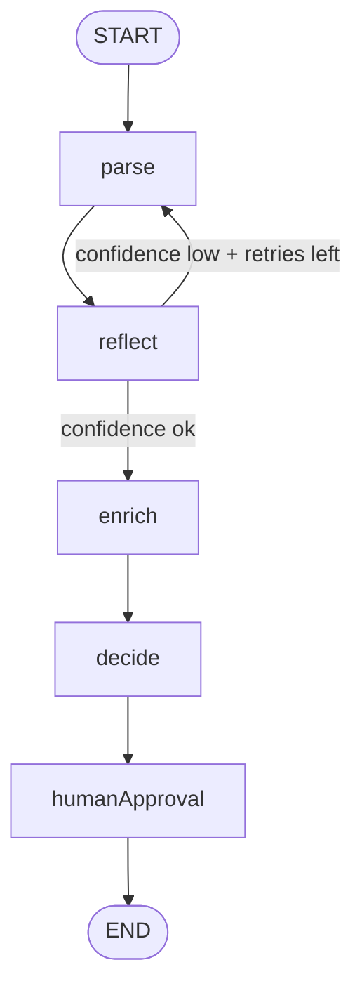

# jz-genai-agent-toolkit

[](#quick-start)
[](#license)
[](#)

A vendor-agnostic, portable agentic core built on LangGraph.js with multi-provider LLM routing and LLM-native observability.

## Architecture



## Quick start

```bash
git clone https://github.com/jzimdars-RTG/JZ-genai-.git
cd JZ-genai-
npm install
cp .env.example .env
node examples/simple-parse/index.js
```

## Configuration

| Env var | Required | Default | Description |
|---|---|---|---|
| `LLM_PRIMARY_PROVIDER` | No | `vertexai` | Primary provider (`vertexai` or `azureai`) |
| `LLM_FALLBACK_PROVIDER` | No | `azureai` | Fallback provider |
| `ENABLE_FALLBACK` | No | `true` | Enables fallback on primary failure |
| `VERTEX_AI_PROJECT` | Vertex | - | GCP project for Vertex AI |
| `VERTEX_AI_LOCATION` | No | `us-central1` | Vertex AI location |
| `VERTEX_AI_MODEL` | No | `gemini-2.0-flash-001` | Vertex model name |
| `GOOGLE_APPLICATION_CREDENTIALS` | Vertex* | - | Service account credential path |
| `AZURE_AI_ENDPOINT` | Azure | - | Azure AI Inference endpoint |
| `AZURE_AI_KEY` | Azure | - | Azure AI Inference API key |
| `AZURE_AI_MODEL` | No | `Kimi-K2-Instruct` | Azure model name |
| `MAX_REFLECTION_RETRIES` | No | `2` | Max parse/reflect retry loops |
| `REFLECTION_CONFIDENCE_THRESHOLD` | No | `0.7` | Reflection confidence cutoff |
| `HUMAN_APPROVAL_MODE` | No | `auto` | `auto` or `stdin` |
| `TRACE_DIR` | No | `traces` | JSONL trace directory |

## Observability

Each model call emits a JSONL line in `traces/run-{timestamp}.jsonl`:

```json
{
  "timestamp": "2026-05-18T12:00:00.000Z",
  "operationName": "agent.parse",
  "provider": "vertexai",
  "model": "gemini-2.0-flash-001",
  "inputTokens": 120,
  "outputTokens": 80,
  "totalTokens": 200,
  "costUSD": 0.000033,
  "latencyMs": 340,
  "success": true
}
```

Use `agent.printSummary()` to print aggregate metrics (call count, total cost, error rate, p50 and p95 latency).

## Usage

```js
import { createAgent } from "jz-genai-agent-toolkit";

const agent = createAgent();
const result = await agent.run({ inputText: "Need a quote from Ann Arbor to DTW" });
console.log(result.state);
agent.printSummary();
```

## Provider switching

Switch providers by editing `.env`:

```bash
LLM_PRIMARY_PROVIDER=azureai
LLM_FALLBACK_PROVIDER=vertexai
```

## Consume via git subtree

```bash
git remote add toolkit https://github.com/jzimdars-RTG/JZ-genai-.git
git subtree add --prefix vendor/jz-genai-agent-toolkit toolkit main --squash
```

## License

MIT License.
